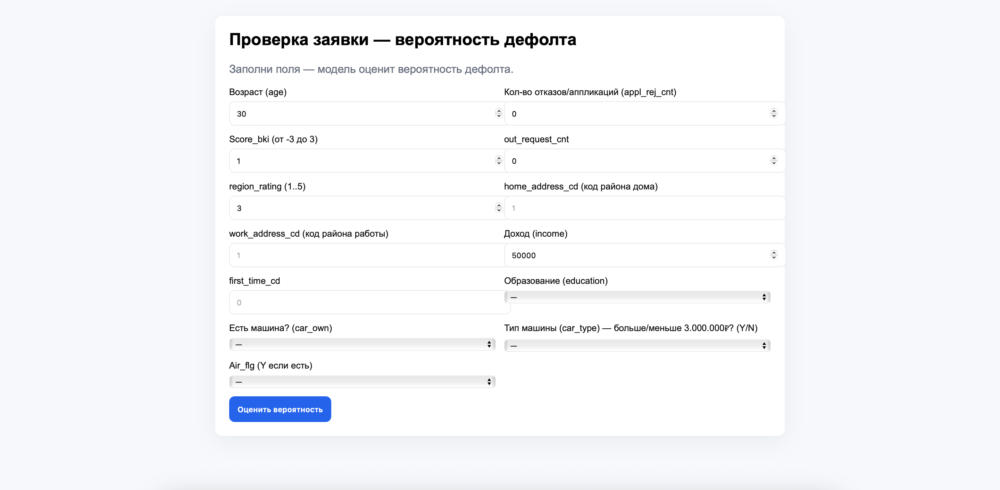

# Credit-Scoring

метрики на тесте: roc-auc: 0.717, f-1 score: 0.318
В общем, сначала я взял плохой датасет, сделал на нем градиентный бустинг (CatBoost), и получил провальные результаты при предсказывании модели. Но я не отчаялся)
Я решил взять другой датасет (Т-банка с kaggle) и на нем обучить линейную регрессию (я пробовал и CatBoost и LightGBM, но для CatBoost там мало категориальных фичей, а LGBM, хоть и выдавал roc-auc что-то в районе 0.718, но мне кажется интерпретируемость модели, особенно в кредитном скоринге, важнее чем +0.001 к roc-auc. Поэтому я отобрал признаки и сделал линейную регрессию. Также я сделал небольшой веб интерфейс, сделал бекенд на FastAPI. Вы вбиваете данные, а модель сразу выдает вероятность дефолта по кредиту (еще и с в процентах) 

Описание полей:
- `id` — Анонимизированный идентификатор заявителя  
- `application_dt` — Дата подачи заявки  
- `sample_cd` — Категория выборки  
- `education_cd` — Образование  
- `gender_cd` — Пол  
- `age` — Возраст  
- `car_own_flg` — Флаг наличия автомобиля  
- `car_type_flg` — Флаг наличия иномарки  
- `appl_rej_cnt` — Количество отказанных прошлых заявок  
- `good_work_flg` — Флаг наличия "хорошей" работы  
- `Score_bki` — Скор балл по данным из бюро кредитных историй  
- `out_request_cnt` — Количество запросов в бюро  
- `region_rating` — Рейтинг региона  
- `home_address_cd` — Категоризатор домашнего адреса  
- `work_address_cd` — Категоризатор рабочего адреса  
- `income` — Доход заявителя  
- `SNA` — Связь заявителя с клиентами  
- `first_time_cd` — Давность наличия информации о заявителе  
- `Air_flg` — Наличие загран паспорта  
- `default_flg` — Флаг дефолта по кредиту

Приложение работает следующим образом, вам нужно из коренной папки вызвать: uvicorn backend.main:app --reload
После чего, нужно открыть index.html как файл.

Теперь вы можете пользоваться сервисом скоринга)

метрики на тесте: roc-auc: 0.717, f-1 score: 0.318
В общем, сначала я взял плохой датасет, сделал на нем градиентный бустинг (CatBoost), и получил провальные результаты при предсказывании модели. Но я не отчаялся)
Я решил взять другой датасет (Т-банка с kaggle) и на нем обучить линейную регрессию (я пробовал и CatBoost и LightGBM, но для CatBoost там мало категориальных фичей, а LGBM, хоть и выдавал roc-auc что-то в районе 0.718, но мне кажется интерпретируемость модели, особенно в кредитном скоринге, важнее чем +0.001 к roc-auc. Поэтому я отобрал признаки и сделал линейную регрессию. Также я сделал небольшой веб интерфейс, сделал бекенд на FastAPI. Вы вбиваете данные, а модель сразу выдает вероятность дефолта по кредиту (еще и с в процентах) 

Описание полей:
- `id` — Анонимизированный идентификатор заявителя  
- `application_dt` — Дата подачи заявки  
- `sample_cd` — Категория выборки  
- `education_cd` — Образование  
- `gender_cd` — Пол  
- `age` — Возраст  
- `car_own_flg` — Флаг наличия автомобиля  
- `car_type_flg` — Флаг наличия иномарки  
- `appl_rej_cnt` — Количество отказанных прошлых заявок  
- `good_work_flg` — Флаг наличия "хорошей" работы  
- `Score_bki` — Скор балл по данным из бюро кредитных историй  
- `out_request_cnt` — Количество запросов в бюро  
- `region_rating` — Рейтинг региона  
- `home_address_cd` — Категоризатор домашнего адреса  
- `work_address_cd` — Категоризатор рабочего адреса  
- `income` — Доход заявителя  
- `SNA` — Связь заявителя с клиентами  
- `first_time_cd` — Давность наличия информации о заявителе  
- `Air_flg` — Наличие загран паспорта  
- `default_flg` — Флаг дефолта по кредиту

Приложение работает следующим образом, вам нужно из коренной папки вызвать: uvicorn backend.main:app --reload
После чего, нужно открыть index.html как файл.

Теперь вы можете пользоваться сервисом скоринга)

